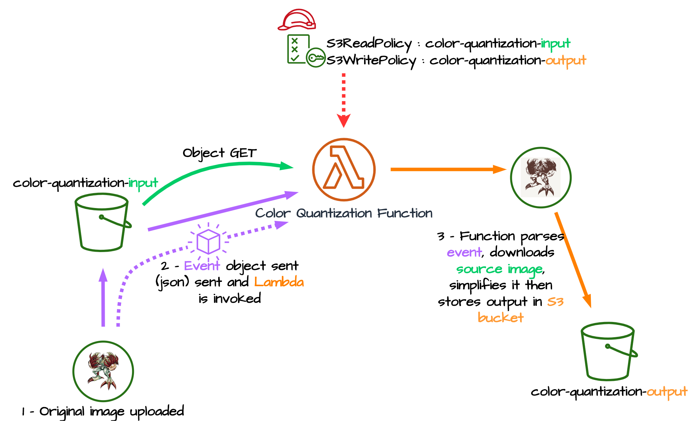

# Color quantization

This project is just a small project to use AWS Serverless Application Model (SAM) and doing some image treatment in python.

The application architecture is :
- A s3 bucket to store incoming image
- A lambda to process the image
- A s3 bucket to store the processed image.

## Image simplification

This app reduce the number of color of an image. It use the K-means clustering method to extract the most used K colors and apply them to the original image (see https://scikit-learn.org/stable/auto_examples/cluster/plot_color_quantization.html). The lambda will try different numbers of colors (from 8 to 32), and keeps the K-means clustering with the best silhouette (see https://scikit-learn.org/stable/auto_examples/cluster/plot_kmeans_silhouette_analysis.html). It's not a perfect method, because for a lot of image it selects only the K-means with the minimum number of cluster. I need to do some more research to understand why.

To speed up the process time, the lambda don't use the full image, but only a sample of 1000 points. With full images, it can take more than one hour to compute all the K-means results and their silhouette. But it's not a big deal because I compute a simplified image at the and. A little loss in quality is acceptable to speed up computation.

## K-means algorithm

K-means is a unsupervised clustering method. The algorithm will find all by itself the best cluster. The algorithm is pretty simple :

1. Associate each point to one of the k clusters randomly.

2. Compute the center of gravity (*centroid*) of each cluster.
3. Associate each point to the closest centroid using the Euclidian distance.
4. Repeat steps 2-3 until the centroids converge.

To apply it to image, we need to convert the image to the right data format. Each pixel can be represented as a triplet of the red, green and blue values. So the final dataset will have 3 dimensions, one for the red color, one for the green and one for the blue.

Once again to speed up the process, not all pixels will be used. Only 1000 will be sampled. Because K-means algorithm has a time complexity of $\mathcal{O}(n^2)$, increasing the sample size by 5 or 10 can drastically increase the computation time.

## What I learned

I find two limitations with this project.
- First sckitlearn + opencv don't fit in basic python lambda. It's just to big (>250 Mo unzipped). I had to use a docker image. But the image need some external dependencies (see [Dockerfile](Dockerfile)). Maybe using EKS is a better solution.
- Second, it's easy to encounter circular dependencies in SAM. I can't refer my input bucket by its reference in lambda policies but only by its name (see [template.yml](template.yml))

Although SAM has some limitations for defining the architecture it has some advantages. First it's easy to create a lambda triggered after a `s3:CreateObject`, second it's simpler to debug a lambda locally with a `sam local invoke --event event/event.json --env-vars env.json` than uploading the lambda to try it.

Overall, for a small serverless project AWS SAM seems a good solution !